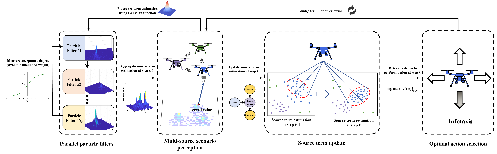
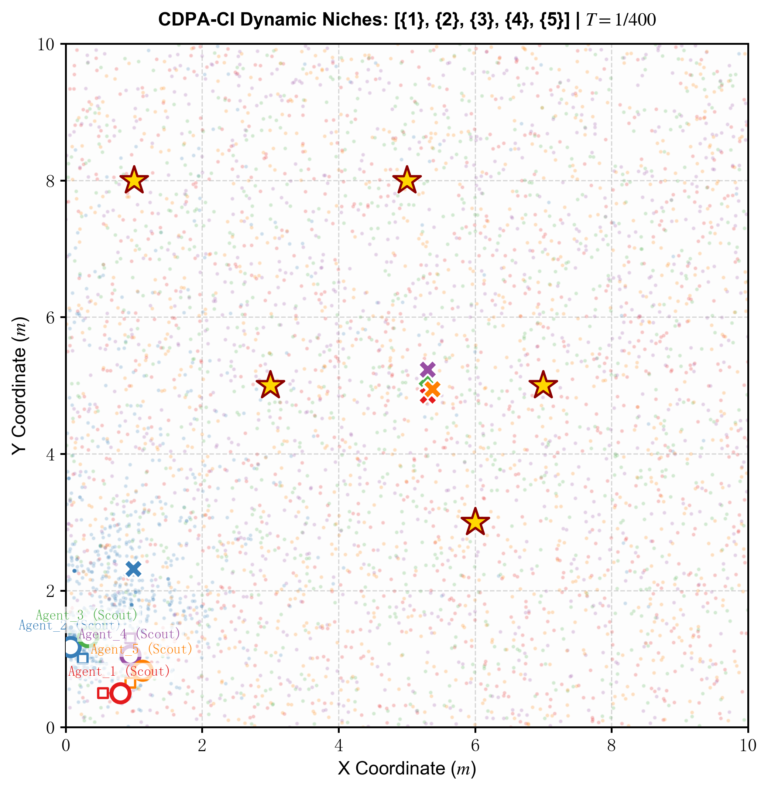
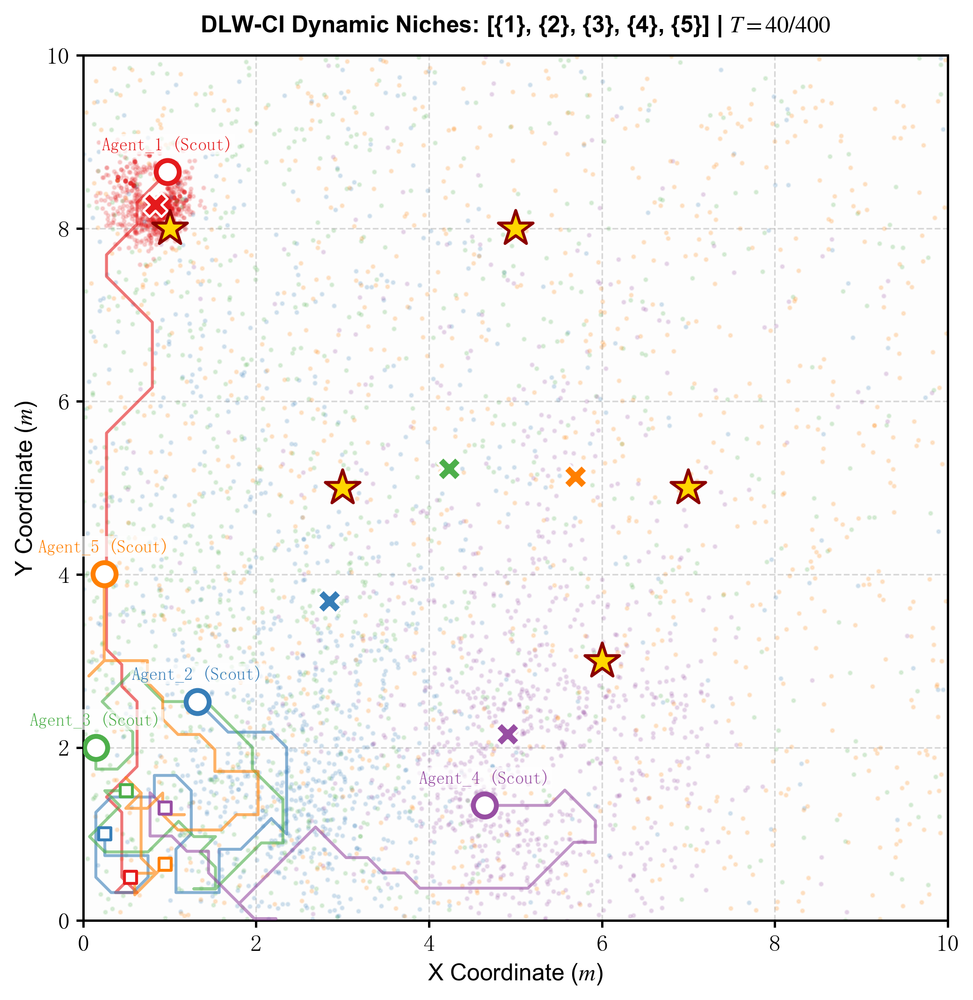
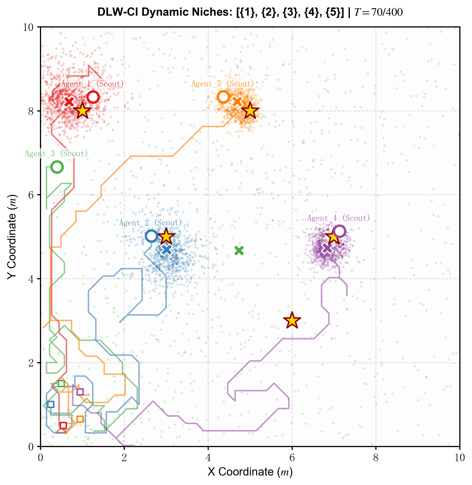
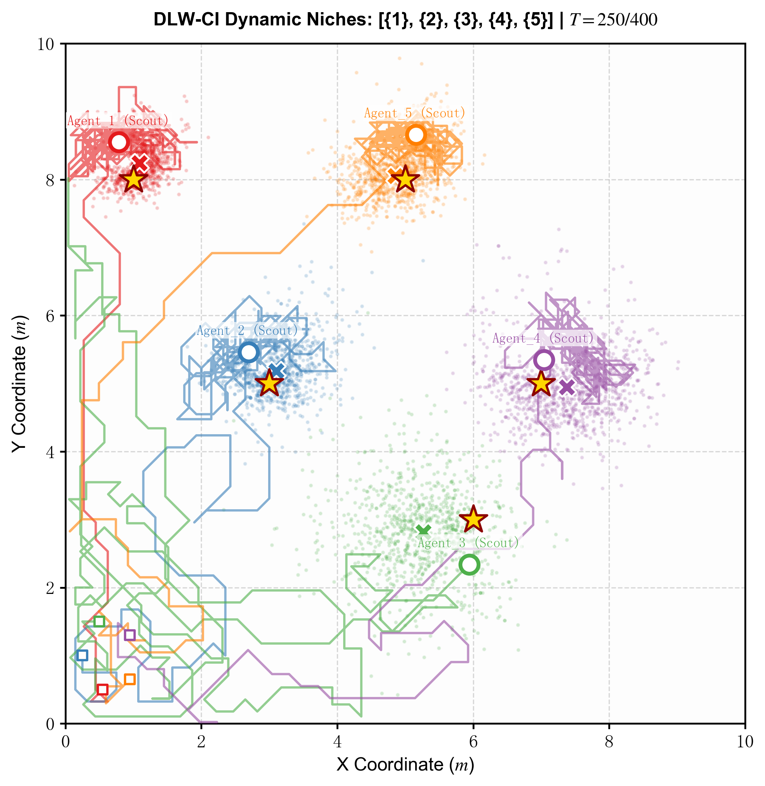

# DLW-CI: Scalable Multi-Source Hazard Localization Using Consumer-Grade Drones

[](https://doi.org/10.1109/TCE.2025.3603610)
[]()

Official implementation of the paper **"Scalable Multi-Source Hazard Localization Using Consumer-Grade Drones in Urban Environments"** (IEEE Transactions on Consumer Electronics, 2025).

## Overview

This repository implements a **multi-robot cooperative search** framework for locating **multiple gas emission sources** in urban environments using consumer-grade drones. The core algorithm, **DLW-CI (Dynamic Likelihood Weight — Collective Intelligence)**, combines:

- **Parallel Particle Filters** — each drone maintains its own particle filter layer for source belief estimation
- **Dynamic Likelihood Weighting** — adaptively weights sensor measurements based on environmental conditions
- **Diversity Regularization & Bounded Novelty** — prevents convergence to the same source and encourages exploration of unvisited areas
- **Multi-Source Declaration** — enables robots to collaboratively identify and lock onto distinct sources

## Quick Start

### Requirements

```bash
pip install numpy matplotlib
```

### Run

```bash
python seeking_DLW-CI.py
```

The script will execute the full multi-drone cooperative search simulation and generate visualization results.

## Algorithm Pipeline



> **Fig. 4. Workflow of the DLW-CI approach**, consisting of four sequential modules: (1) **Parallel particle filters** — computes the dynamic likelihood weight via inter-drone parameter sharing and aggregates multi-filter outputs into a predicted value; (2) **Multi-source scenario perception** — the drone senses the environment and fits the prior source estimate with a Gaussian function for parameter aggregation; (3) **Source term update** — refines the source estimate from prior to posterior via Bayes' theorem; (4) **Optimal action selection** — the drone chooses its next action by maximizing the Infotaxis reward function. The cycle repeats until termination.

## Simulation Results

The following snapshots show the algorithm's performance at different stages of the search process:

|        Step 1        |   Step 40   |
| :-------------------: | :----------: |
|  | |

|         Step 70         |         Step 250         |
| :---------------------: | :-----------------------: |
|  |  |

> **Legend:** Colored **X** markers represent the estimated source locations (one color per drone/agent); yellow ★ stars indicate the true source positions. The background heatmap shows the gas concentration field.

## Citation

If you find this work useful in your research, please cite:

```bibtex
@ARTICLE{11152624,
  author={Zhang, Xiaoran and Ji, Yatai and Zhao, Yong and Ai, Chuan and Chen, Bin and Zhu, Zhengqiu},
  journal={IEEE Transactions on Consumer Electronics},
  title={Scalable Multi-Source Hazard Localization Using Consumer-Grade Drones in Urban Environments},
  year={2025},
  volume={71},
  number={4},
  pages={10746-10762},
  keywords={Drones;Estimation;Location awareness;Search problems;Sensors;Accuracy;Navigation;
            Particle swarm optimization;Energy efficiency;Wind speed;Consumer-grade drones;
            multi-drone cooperative search;multiple sources;dynamic likelihood weight;
            parallel particle filters;urban environments},
  doi={10.1109/TCE.2025.3603610}
}
```

## Project Structure

```
.
├── Assets/                  # Figures and pipeline diagram
│   ├── 1.png               # Simulation step 1
│   ├── 45.png              # Simulation step 45
│   ├── 85.png              # Simulation step 85
│   ├── 145.png             # Simulation step 145
│   └── pipeline.png        # Algorithm framework diagram
├── Results/                # Output results for each run
├── seeking_DLW-CI.py       # Main entry point
└── README.md
```

## License

This project is released for academic and research purposes. See the paper for additional details.
